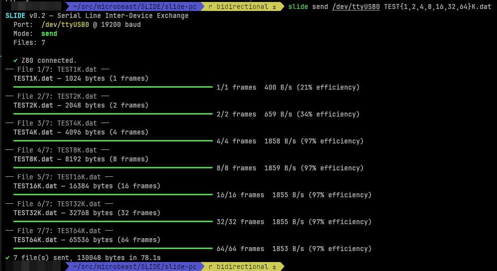

# SLIDE - Serial Line Inter-Device (file) Exchange

File transfer from PC to the [FeerSum Beasts MicroBeast Z80 Computer](https://feersumbeasts.com/microbeast.html) (Z80! CP/M!) over a serial link.

Sliding window protocol with CRC-16 error detection and hardware flow control.

95%+ link utilisation for files > 2K. CP/M binary is 1.3 KBytes.

Other Z80 based computers are available, and might work with a bit of fiddling about. IO ports and baud rates and such.

## MicroBeast side

Build with sjasmplus:

```
make slide.com
```

Copy `slide.com` to a CP/M disk and run:

```
A> SLIDE
```

Or, you can `make disk` (you'll need cpmtools) and transfer  `slide_p25.img` to your system using whichever inferior serial transfer tools you are currently having to tolerate.

SLIDE waits up to ~30 seconds for the PC to connect. `slide send /dev/ttyUSB0 TEST1K.dat` on the PC end will kick off a transfer.

`SLIDE` is an alias for `SLIDE R` ("slide receive") - meaning that the MicroBeast will download and save any files sent from the PC side.

You can also **send** files from the MicroBeast:

```
A> SLIDE S TEST1K.DAT
```

On the PC side the corresponding command is `slide recv /dev/ttyUSB0` to start receiving the files. They'll go in the current directory: you can specify the option `--output-dir SOMEDIR` to change that.

## PC side

You've got a couple of options here, you can either use the all-singing, all-dancing unified Rust binary, or you can mess about with the original shonky Python scripts.

### Unified rust binary

To build the `slide` executable for your system, change into the `slide-rs` directory and type `cargo build --release`.  This will net you a binary in `target/release/slide` that you can copy to somewhere on your PATH (I stick it in `~/.local/bin`).

Then to send a single file:

```
slide send /dev/ttyUSB0 TEST1K.dat
```

and type `slide` on the MicroBeast to get things going.

To send multiple files:

```
slide send /dev/ttyUSB0 TEST1K.DAT TEST{1,2,4,8,16,32,64}K.dat
```

and type `slide` on the MicroBeast to get things going.

Look at the pretty:



If you want to know all the options, `slide --help` has got you covered.

### Shonky Python scripts

Requires Python 3.10+ and [uv](https://docs.astral.sh/uv/):

```
cd slide-pc
uv sync
uv run slide-send /dev/ttyUSB0 myfile.com
```

Options:

```
uv run slide-send /dev/ttyUSB0 myfile.com --baud 19200 --debug
```

- `--baud` — baud rate (default: 19200)
- `--debug` — show wire-level frame and control byte trace

If you change the baudrate, you'll have to change the baudrate divisor in `slide.asm` to match

## Protocol

- 19200 baud, 8N1, RTS/CTS hardware flow control
- Sliding window: 4 frames, 1024 bytes/frame
- CRC-16-CCITT (poly 0x1021, init 0xFFFF)
- Frame: `[SOF 0x01] [SEQ] [LEN_H] [LEN_L] [PAYLOAD...] [CRC_H] [CRC_L]`
- Control: `ACK 0x06 + seq`, `NAK 0x15 + seq`, `RDY 0x11`, `CAN 0x18`

## Hardware

- Z80 at 8MHz with TL16C550 UART (1.8432MHz crystal, divisor 6 = 19200 baud)
- USB serial cable on PC side
- UART FIFOs enabled with auto RTS/CTS flow control

## Things I've tested

YMMV, but I've tried:

- sending a zero-length file
- sending files that fit in a single packet (<1 Kb)
- sending files that require multiple packets
- sending files that are bigger than RAM
- sending files that are bigger than free disk space (and handling the error)
- disconnecting PC part way thru transfer
- disconnecting Z80 part way thru transfer
- overwriting existing files on z80 disk
- starting z80 before pc
- starting pc before z80
- sending filename with no extension
- sending very long filenames on PC side
- writing to A: (a bug in 1.7 makes this weirder than it ought to be)

## Things I've not tested

- target file exists and is read-only (need to figure out the `stat` runes)
- building slide-rs on MacOS or... Windows lol
