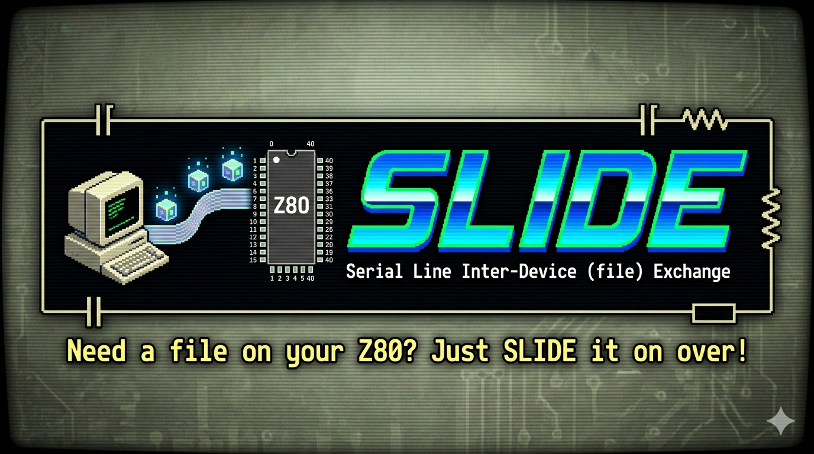
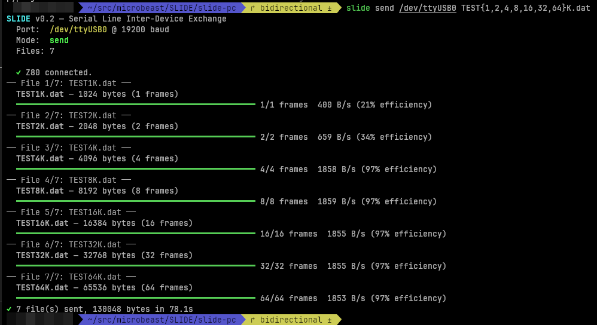

# SLIDE - Serial Line Inter-Device (file) Exchange



Full width 8-bit File transfer from PC to the [FeerSum Beasts MicroBeast Z80 Computer](https://feersumbeasts.com/microbeast.html) (Z80! CP/M!) over a serial link.

Sliding window protocol with CRC-16 error detection and hardware flow control.

95%+ link utilisation for files > 2K. CP/M binary is 3.7 KBytes.

Other Z80 based computers are available, and might work with a bit of fiddling about. IO ports and baud rates and such. Note that SLIDE 
relies on 8-bit transfers and hardware flow control. It can work without flow control, but it's not as efficient. You *could* adapt it 
to work in 7 bits (or fewer), but you'd probably be better of with the battle tested [ZMP](https://github.com/mecparts/zmp) (ZMODEM) if 
you're restricted to an "8-bit clear" system.



## Installation

### On the MicroBeast

Copy `slide.com` from [the latest release](https://github.com/blowback/slide/releases) to your MicroBeast, using whichever serial transfer software you are currently forced to tolerate.

Alternatively you can use the monitor's Y-Modem transfer capability to copy over the disk image `slide_p25.img` using the "Address from file" option, then when it has transferred select the "CP/M disk" option.

Once you've got on your MicroBeast, it's a good idea to copy it on to your RAM disk and use the MicroBeast's `save` utility to persist it.

### On your PC

Copy the relevant binary for your system (one of `slide-linux-amd64`, `slide-macos-amd64`, or `slide-windows-amd64.exe`) from the [latest release](https://github.com/blowback/slide/releases) to your PC. These are rust executables that handle both sending and receiving. If you prefer to use python, the original scripts are in `slide-py` - see [Python scripts](#python-scripts) for more info.

#### A note for MacOS users

Apple have made it impossible to "staple" single Mach-O binaries like `slide`: this means that the first time you run it, Gatekeeper on your system will do an online check, so you need internet access.

If you want to run it offline, you can:

```
xattr -d com.apple.quarantine ./slide-macos-amd64
```

which will disable GateKeeper checks entirely. 


Don't worry, we are fully legit ;-) If you are nervous about this, you can verify the binary on a different, internet-connected mac:

```
codesign -dv --verbose=4 ./slide-macos-amd64

```

which will show you my team credentials, and:

```
codesign --verify --verbose ./slide-macos-amd64
```

should get you `valid on disk` and `satisfies its Designated Requirement`.

You can then check the notarization status with:

```
spctl --assess --verbose ./slide-macos-amd64
```

which should say `accepted` and `source: Notarized Developer ID`.

If your happy with that, copy that exact same binary to your air-gapped mac. 

## Transferring files

### Sending files from PC to MicroBeast

On the MicroBeast, run:

```
slide
```

`slide` is an alias for `slide r` - slide in receive mode. This will wait up to 30 seconds for the PC to establish a link.

On the PC, run:

```
slide send /dev/ttyUSB0 TEST1K.dat
```

To kick off a transfer.

You can send multiple files in one go:

```
slide send /dev/ttyUSB0 TEST1K.dat TEST2K.dat TEST4K.dat
```

### Sending files from MicroBeast to PC 

It works in reverse too: this time we use "send" mode on the MicroBeast:

```
send S TEST1K.DAT 
```

and on the PC side:

```
slide recv /dev/ttyUSB0
```

This will put received files in the current directory. You can change that:

```
slide recv --output-dir /tmp /dev/ttyUSB0
```


## Remote filing

New in wire protocol v0.3 (`slide.com` v0.6.1). The PC can now ask the MicroBeast what disks it has and what's on them, without transferring a thing.

Start the MicroBeast in receive mode as usual (`slide`), then on the PC:

### What volumes are there?

```
slide probe /dev/ttyUSB0 --cmd vols
```

```
--- CMD_VOLS ---
  Status: 0x00 — ST_OK
  Present: A: B:
  Logged:  A: B:
  Current: B:
```

Two answers, because CP/M can't give you one. "Logged" is BDOS's login vector — drives that have been touched since the last reset. "Present" is what's actually there, which BDOS simply cannot tell you: the only way to ask is to call BIOS `SELDSK` for each drive and see whether it hands back a disk parameter header or a zero.

### What's on them?

```
slide probe /dev/ttyUSB0 --cmd dir
```

```
--- CMD_DIR ---
  Status: 0x00 — ST_OK
  USER NAME         ATTR       BYTES
  0    SLIDE.COM                3840
  0    BBCBASIC.COM            18944
  0    MBASIC.COM              24320
  0    LEDS.BAS                 1280
  0    OTHER.FS     R/O          128
  ...
```

With no arguments that lists whatever drive the MicroBeast currently has selected. To pick one:

```
slide probe /dev/ttyUSB0 --cmd dir --drive b:
```

`--drive` takes `a:`, `A`, or a bare `0`-`15`. There's a `--user` too, same idea, for CP/M user numbers. Leave either out and you get the current one.

The MicroBeast checks the drive is really there (BIOS `SELDSK` again) before selecting it, and puts the previous drive and user back afterwards — so listing `B:` doesn't leave the rest of your session pointed at the wrong disk.

Sizes come from `F_FSIZE`, so they're in whole 128-byte records — treat them as an upper bound, same as CP/M's own `stat` does. Files bigger than 16K appear once, not once per extent.

### Deleting and renaming

```
slide probe /dev/ttyUSB0 --cmd del --match OLDFILE.BAK
slide probe /dev/ttyUSB0 --cmd ren --match OLD.TXT --to NEW.TXT
```

`--match` takes a CP/M pattern, so `*.BAK` and `A?.COM` work the way you'd expect. Delete reports how many files went:

```
--- CMD_DEL (B: ????????.BAK) ---
  Status: 0x00 — ST_OK
  Deleted 3 file(s)
```

You can filter a listing the same way: `--cmd dir --match "*.COM"`.

Two safety notes. There's no "delete everything" default — `--cmd del` without `--match` is an error, not a wildcard. And a `--match` containing a wildcard needs `--yes` as well, because CP/M has no undelete and `--drive` makes it far too easy to aim at the wrong disk.

The MicroBeast checks before it acts: it refuses with `ST_RO` rather than touching a read-only file, and refuses a rename with `ST_EXISTS` if the target name is taken. Both matter more than they sound — CP/M's own rename will cheerfully create two files with the same name, and deleting a read-only file prints `Bdos Err` and reboots the machine out from under the session.

### Driving it without a terminal

If your terminal *is* the serial port — which it is, on a MicroBeast — you can't start `slide` on the Beast and then hand the port over to the PC tool. There's no moment when both can have it.

So the tool can type at the CP/M prompt for you:

```
slide probe /dev/ttyUSB0 --start-cmd "slide r" --cmd dir
```

That sends a CR to clear the prompt, types the command, and then does the handshake — all on the port it already holds. Use `--start-cmd "b:slide r"` if the binary lives on another drive.

This is also the more reliable order generally: the PC end is holding RTS before the Z80 enters SLIDE mode, which is what the wakeup signature needs.

### Talking to older firmware

Safe. The probe sends a single byte (`ENQ`, 0x05) that v0.2.1 firmware skips as noise, so nothing is sent that an old `slide.com` could misread as a file header. If there's no answer, you get:

```
  Outcome:  unsupported
```

and the session carries on as normal — you can still transfer files in the same session. Tested against v0.5.x firmware on real hardware, not just reasoned about.

The full protocol is written up in [docs/SPEC-v0.3.md](docs/SPEC-v0.3.md).

### All the options

```
slide probe <port> [options]
```

What to run, and where:

- `--cmd nop|vols|dir|del|ren` — which command to send (default: `nop`, which just asks "do you speak v0.3?" and gets out of the way)
- `--match PATTERN` — filename or CP/M pattern. Filters `dir`, required for `del`, names the existing file for `ren`
- `--to NAME` — the new name, for `ren`
- `--yes` — allow a wildcard `del` without confirmation
- `--drive A-P|0-15` — drive to list with `--cmd dir`. Omit for the currently selected one
- `--user 0-15` — CP/M user number to list. Omit for the current one
- `--start-cmd "slide r"` — type this at the MicroBeast's CP/M prompt instead of needing a separate terminal
- `--baud` — baud rate (default: 19200)

Diagnostics, mostly of interest if you're poking at the protocol itself:

- `--then-send FILE` — after probing, send a file, to prove the probe didn't upset the session
- `--probe-after` — probe a second time after that transfer
- `--no-fin` — leave the MicroBeast sitting in its file loop instead of closing the session
- `--attempts N` — how many times to send the probe byte before giving up (default: 3)
- `--timeout MS` — how long to wait for each reply (default: 500)
- `--settle MS` — pause after the handshake before probing, so the Z80's FIFO flush doesn't eat the first attempt (default: 100)
- `--debug` — full wire-level trace: every stray byte, every frame, every ACK

The python scripts take the same options: `uv run slide-probe /dev/ttyUSB0 --cmd dir --drive b:`.

### Fair warning

`probe` started life as a diagnostic for testing backwards compatibility, and it still prints like one. A friendlier `slide dir` / `slide vols` would be the obvious next step; it doesn't exist yet.

## Build it yourself

If you want to build it yourself, the top-level `Makefile` will build the z80 binary and a CP/M disk image. You'll need [sjasmplus](https://github.com/z00m128/sjasmplus) and [cpmtools](https://github.com/z00m128/sjasmplus).

Python PC tools are in `slide-py`.

Rust PC tools are in `slide-rs` - just `cargo build --release` in there.


### Python scripts

Requires Python 3.10+ and [uv](https://docs.astral.sh/uv/):

```
cd slide-pc
uv sync
uv run slide-send /dev/ttyUSB0 myfile.com
```

Options:

```
uv run slide-send /dev/ttyUSB0 myfile.com --baud 19200 --debug
```

- `--baud` — baud rate (default: 19200)
- `--debug` — show wire-level frame and control byte trace

If you change the baudrate, you'll have to change the baudrate divisor in `slide.asm` to match

## Protocol

- 19200 baud, 8N1, RTS/CTS hardware flow control
- Sliding window: 4 frames, 1024 bytes/frame
- CRC-16-CCITT (poly 0x1021, init 0xFFFF)
- Frame: `[SOF 0x01] [SEQ] [LEN_H] [LEN_L] [PAYLOAD...] [CRC_H] [CRC_L]`
- Control: `ACK 0x06 + seq`, `NAK 0x15 + seq`, `RDY 0x11`, `CAN 0x18`
- Commands (v0.3): `ENQ 0x05` announces a command frame; the reply is a status frame plus fixed-size records, framed exactly like file data

## Hardware

- Z80 at 8MHz with TL16C550 UART (1.8432MHz crystal, divisor 6 = 19200 baud)
- USB serial port on PC side
- UART FIFOs enabled with auto RTS/CTS flow control

## Things I've tested

YMMV, but I've tried:

- sending a zero-length file
- sending files that fit in a single packet (<1 Kb)
- sending files that require multiple packets
- sending files that are bigger than RAM
- sending files that are bigger than free disk space (and handling the error)
- disconnecting PC part way thru transfer
- disconnecting Z80 part way thru transfer
- overwriting existing files on z80 disk
- starting z80 before pc
- starting pc before z80
- sending filename with no extension
- sending very long filenames on PC side
- writing to A: (a bug in 1.7 makes this weirder than it ought to be)
- linux, windows and macos builds of the rust tool 
- very light testing on macos and windows 
- v0.3 commands against v0.2.1 firmware (ignored cleanly, session survives)
- listing a 52-file drive and diffing it against CP/M's own `dir`
- 70 back-to-back `--cmd dir` runs looking for intermittents (found one, fixed it)
- directory listings long enough to need several frames


## Things I've not tested

- target file exists and is read-only (need to figure out the `stat` runes)
